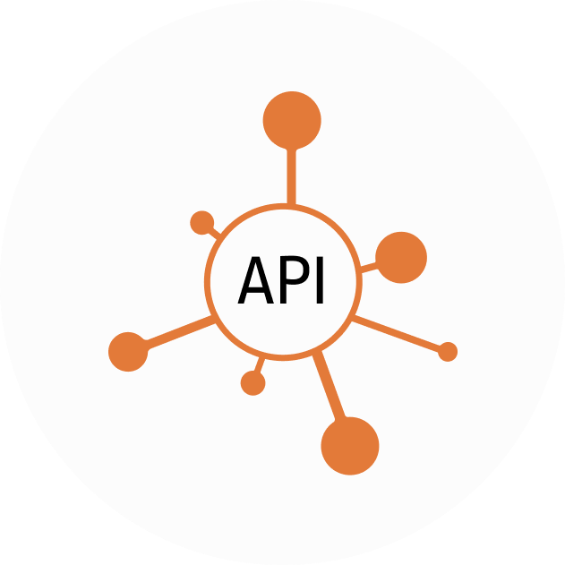

  

<h1 align="center">Plumber API</h1>

  <a href="https://github.com/pashkatrick/Plumber-API">  
  <a href="https://github.com/pashkatrick/Plumber">
  
    

## About
That's an API for main project [Plumber RPC](https://github.com/pashkatrick/Plumber-API) which in turn is a GUI for [GRPCurl](https://github.com/fullstorydev/grpcurl). 

## ⚡ Important

> This version doesn't support import proto files or protosets yet (will be).  
> You can use it only with servers, which support reflection API.

## Features
...

### Requirenments

- Docker

## Build and launch 🚀

- download last version build
- install it
- use `docker pull pashkatrick/plumber-api`
- and `docker run ...`
